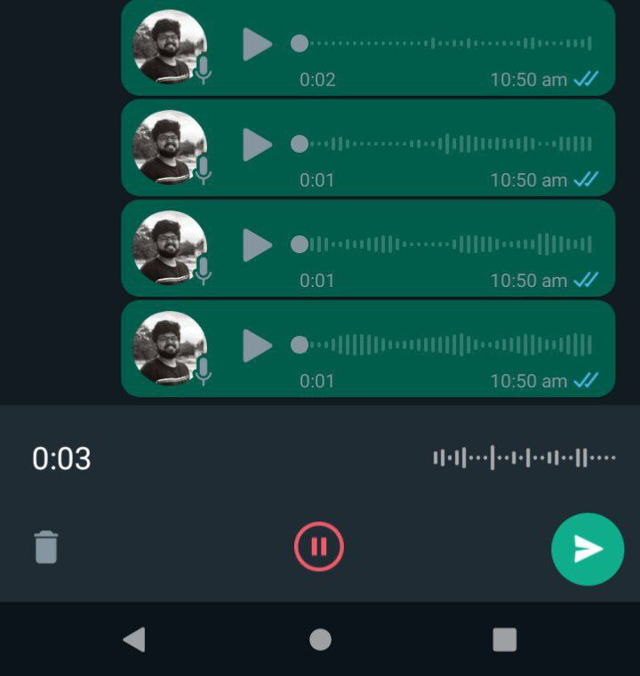

# Test Document: WhatsApp Audio Message Validation
- Test Case Name: WhatsApp Audio Message Validation
- Tester Name: Sreekanth C
- Test Date: 2023-05-21
- Pre-Requisite: WhatsApp mobile app should be installed and running with a valid user account

**Note:** This test document is specific to the WhatsApp mobile app and does not cover the website version.

## Test Cases:
| Step # | Test Step | Expected Result | Priority |
| ------ | --------- | --------------- | -------- |
| 1      | Launch the WhatsApp app and navigate to a new chat screen. | Verify the user is able to view the mic icon in the lower right corner. | 1 |
| 2      | Tap on the audio recording button for the first time. | App should prompt for mic permission. | 1 |
| 3      | Click on the audio recording button when permission is given. | App should start recording. | 1 |
| 4      | Tap on the audio recording button when permission is granted. | App should show a popup and redirect to settings. | 1 |
| 5      | Tap on the audio recording button when permission is denied. | Blinking red color mic button should appear in the lower left corner. | 1 |
| 6      | Long press on the audio button post permission is granted. | Verify the user is able to view the length of recording in the lower left side, next to the blinking red color mic button. Verify the user is able to view "Slide to cancel" text to the left of the recording button. | 1 |
| 7      | Record a message and release to send the message. | Verify the audio message is sent to the recipient. | 1 |
| 8      | Tap and hold the audio recording button, record a message, and swipe left to cancel. | Verify the audio message is discarded, and no audio message is sent. | |
| 9      | Tap on the record button and swipe up. | Verify the user is able to see the recording screen with the sound waveform in the bottom of the screen. | 1 |
| 10     | Tap on the record button, swipe up, and press the pause button. | Verify the user is able to pause the recording. | 1 |
| 11     | Tap on the record button, swipe up, and press the delete button. | Verify the user is able to delete the recording. | 1 |
| 12     | Click on the record button and swipe up and press on the send button. | Verify the user is able to send the message to the recipient. | 1 |
| 13     | Record an audio message in a group chat. | Verify the audio message is sent to all group chat members. | 2 |
| 14     | Record an audio message while the device is connected to an external audio output (e.g., Bluetooth headphones). | Verify that the audio message is recorded via the external audio source. | 2 |
| 15     | Record an audio message while the device is in Airplane mode. | Verify the user is able to record the message. Verify a "resend" icon is displayed along with the voice message. | 2 |
| 16     | Record an audio message while receiving an incoming voice/video call. | Verify that the app is pausing the recording and notifies the user about the incoming call. | 2 |
| 17     | Record an audio message while the device is in Do Not Disturb mode. | Verify the audio message is sent to the recipient. | 3 |

| # | Exploratory Testing Considerations |
| --- | --- |
| 1 | Network connectivity variations: Test the audio messaging feature in various network conditions, such as strong Wi-Fi, weak Wi-Fi, 4G, 3G, and 2G networks. This will help identify potential issues that may arise in different network environments. |
| 2 | Device compatibility: Test the audio messaging feature across various Android devices with different hardware, screen sizes, and OS versions to ensure the feature works seamlessly on a wide range of devices. |
| 3 | Battery consumption: Analyze the battery consumption of the audio messaging feature during recording, sending, and playback to ensure it does not significantly drain the device's battery. |
| 4 | App interruptions: Test the behavior of the audio messaging feature when interrupted by system events, such as incoming calls, alarms, or notifications, to ensure the app can handle these interruptions gracefully. |
| 5 | Audio quality: Assess the audio quality of recorded messages in various environments, such as quiet rooms, outdoor spaces, and noisy areas, to ensure a consistent user experience. |
| 6 | Multitasking: Test the audio messaging feature while performing other tasks on the app, such as making voice/video calls, ensuring that the recording feature is off by default. Check the app's performance and stability during multitasking to confirm a seamless user experience. |
| 7 | Accessibility: Test the feature's compatibility with Android's accessibility features, such as TalkBack, to ensure it can be used by people with disabilities. |
| 8 | Error handling: Test the app's behavior when encountering errors during audio recording, sending, or playback, to ensure appropriate error messages are displayed and the app recovers gracefully. |
| 9 | Privacy and security: Test the end-to-end encryption of audio messages to ensure the privacy and security of the users' data. |
| 10 | Data usage: Monitor the data usage of the audio messaging feature during recording, sending, and playback to ensure it does not consume excessive data, which might be a concern for users on limited data plans. |
| 11 | Localization: Test the audio recording feature in various language settings to ensure that translations and regional settings are accurate and do not impact functionality |
| 12 | Recovery: Evaluate how the app handles unexpected events like crashes, restarts, or device shutdowns during audio recording. Check if the app can recover and allow the user to continue recording or save the recorded message. |

